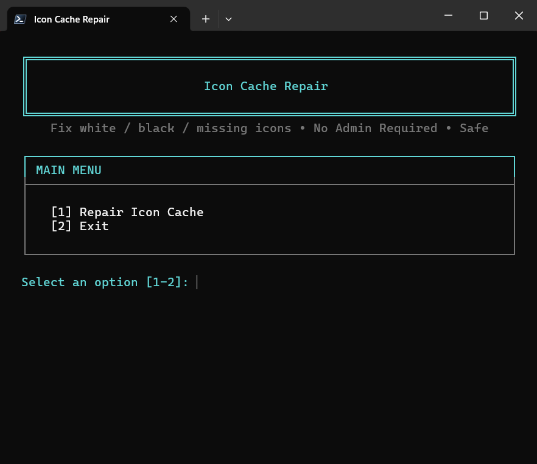
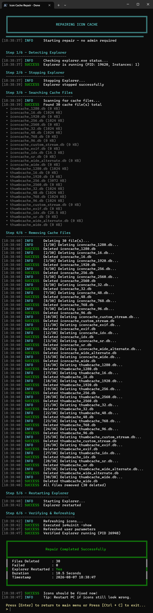

# Icon Cache Repair

A professional, safe, and automation-friendly PowerShell utility for repairing Windows icon and thumbnail cache.

<p align="left">
  <a href="https://github.com/AmrKhalid-dev/Icon-Cache-Repair/releases"></a>
  <a href="https://github.com/AmrKhalid-dev/Icon-Cache-Repair/blob/main/LICENSE"></a>
  <a href="https://github.com/AmrKhalid-dev/Icon-Cache-Repair/commits/main/"></a>
  <a href="https://learn.microsoft.com/powershell/"></a>
  <a href="https://www.microsoft.com/windows"></a>
</p>

> A focused Windows utility for safely rebuilding the Explorer icon and thumbnail cache.

---

## Table of Contents

- [Overview](#overview-v100)
- [Features](#features)
- [Requirements](#requirements)
- [Installation](#installation)
- [Usage](#usage)
- [Parameters](#parameters)
- [Logging & Diagnostics](#logging--diagnostics)
- [Safety & Security](#safety--security)
- [Exit Codes](#exit-codes)
- [Architecture Workflow](#architecture-workflow)
- [Screenshots](#screenshots)
- [Troubleshooting](#troubleshooting)
- [JSON Output](#json-output)
- [Security Policy](#security-policy)
- [License](#license)
- [Author](#author)

---

## Overview v1.0.0

Icon Cache Repair v1.0.0 provides an interactive menu and direct command-line modes for repairing corrupted or missing Windows icons by purging icon and thumbnail cache files, restarting Explorer, and verifying the repair.

**Safety first:**

- **Pre-flight checks**: Verifies OS compatibility, Explorer status, and cache accessibility before making changes.
- **Automatic Fail-Safe**: Uses `try-finally` structures to guarantee that `explorer.exe` restarts even if the script is abruptly aborted (e.g., via Ctrl+C).
- **Forced Process Termination**: Uses `taskkill` with file handle release buffering to properly unlock files before deletion.
- **Post-Repair Verification**: Silently verifies that Explorer is running after the repair completes.
- **Structured Logging**: Optional `-LogPath` parameter records execution details with precise timestamps and log levels.
- **Multiple Cache Types**: Purges both legacy `IconCache.db` and modern `.dat` explorer caches.
- **No Administrator Rights**: Runs completely in user space—safe and easy to run on enterprise or personal machines.

---

## Features

- Repair corrupted, missing, blank, or black Windows icons.
- Purge both legacy `.db` cache files and modern `.dat` explorer caches.
- Forceful Explorer termination with file handle release.
- Automatic fail-safe Explorer restart (`try-finally` guaranteed).
- Windows icon cache refresh via `ie4uinit.exe -ClearIconCache`.
- Windows user parameters refresh via `UpdatePerUserSystemParameters`.
- Detection of current cache status (Explorer running, cache files count, directory).
- Execution logging to file via `-LogPath`.
- Silent execution (`-Silent`) for background scripts and automation.
- Machine-readable JSON output for status queries (`-Json` with `-Mode Status`).
- Professional console interface with interactive status card and ASCII framing.
- No Administrator rights required.

---

## Requirements

| Component | Requirement |
| --- | --- |
| **Operating System** | Windows 10 or Windows 11 (Win32NT platform) |
| **PowerShell** | 5.1 or 7.x+ |
| **Privileges** | Standard User (No Administrator required) |
| **Dependencies** | Built-in Windows system tools (`explorer.exe`, `taskkill.exe`, `ie4uinit.exe`) |

---

## Installation

Clone the repository:

```powershell
git clone https://github.com/AmrKhalid-dev/Icon-Cache-Repair.git
cd Icon-Cache-Repair
```

Run the script directly:

```powershell
.\IconCacheRepair.ps1
```

*No external PowerShell modules or third-party packages are required.*

---

## Usage

### Display Help
```powershell
.\IconCacheRepair.ps1 -Help
```
Displays command usage, available switches, and practical CLI examples.

### Check Version
```powershell
.\IconCacheRepair.ps1 -Version
```

### Interactive Mode
Launch without `-Mode` to open the interactive menu:
```powershell
.\IconCacheRepair.ps1
```
**Interactive options:**
- `1` : Repair Icon Cache
- `2` : Exit

*Interactive Flow: Banner → System Status Card → Menu Selection → Repair Execution → Explorer Stop → Cache Scan → Cache Deletion → Explorer Restart → Refresh → Verification → Result Card.*

### Direct Command-Line Modes

**Check System Status:**
```powershell
# Human-readable output
.\IconCacheRepair.ps1 -Mode Status

# Machine-readable JSON output
.\IconCacheRepair.ps1 -Mode Status -Json
```

**Repair Icon Cache:**
```powershell
# Interactive repair with full UI
.\IconCacheRepair.ps1 -Mode Repair

# Silent repair for automation
.\IconCacheRepair.ps1 -Mode Repair -Silent

# Repair with logging
.\IconCacheRepair.ps1 -Mode Repair -LogPath "C:\Logs
epair.log"
```

### Silent Execution
The `-Silent` switch suppresses normal console banners and status cards. It requires an explicit `-Mode`:
```powershell
.\IconCacheRepair.ps1 -Mode Repair -Silent
.\IconCacheRepair.ps1 -Mode Status -Silent
```

### File Logging
Log execution steps, warnings, and errors to a specified log file using `-LogPath`:
```powershell
.\IconCacheRepair.ps1 -Mode Repair -LogPath "C:\Logs\IconCacheRepair.log"
.\IconCacheRepair.ps1 -Mode Status -LogPath "C:\Logs\IconCacheRepair.log"
```
*The tool automatically creates the directory and file if they do not exist.*

---

## Parameters

| Parameter | Type | Description |
| --- | --- | --- |
| `-Mode` | String | Specifies operation mode: `Repair` or `Status`. |
| `-Silent` | Switch | Suppresses console banner and interactive output. Requires `-Mode`. |
| `-Json` | Switch | Returns machine-readable JSON output (only applicable with `-Mode Status`). |
| `-LogPath` | String | File path for writing operational logs (INFO, SUCCESS, WARNING, ERROR). |
| `-Help` | Switch | Displays command-line usage and parameter descriptions. |
| `-Version` | Switch | Displays current tool version (v1.0.0). |

*Note: The `-Json` switch is only valid with `-Mode Status`.*

---

## Logging & Diagnostics

When `-LogPath` is provided, all operations record structured log entries in UTF-8 format:

```text
[2026-08-31 21:00:00] INFO     Stopping Explorer (1 instance(s))...
[2026-08-31 21:00:01] SUCCESS  Explorer stopped successfully.
[2026-08-31 21:00:01] INFO     Found 5 cache file(s).
[2026-08-31 21:00:02] SUCCESS  Removed thumbcache_1024.db
[2026-08-31 21:00:03] SUCCESS  Removed iconcache_1024.db
[2026-08-31 21:00:04] SUCCESS  Explorer started successfully.
[2026-08-31 21:00:05] SUCCESS  Verification passed. Explorer is running.
```
*Log Levels used:* `INFO`, `SUCCESS`, `WARNING`, `ERROR`.

---

## Safety & Security

- **Targeted Scope**: Modifies only user-specific cache files in `%LOCALAPPDATA%\Microsoft\Windows\Explorer`.
- **No Administrator Rights**: Runs completely in user space—no system-wide changes.
- **Automatic Fail-Safe**: Guarantees Explorer restart even if script is aborted (Ctrl+C).
- **Forced Process Termination**: Uses `taskkill` with file handle release buffering.
- **Post-Repair Verification**: Verifies Explorer is running after repair completes.
- **Cache File Protection**: Removes read-only attributes before deletion when possible.
- **Graceful Error Handling**: Continues operation even if individual files fail to delete.

---

## Exit Codes

| Exit Code | Name | Description |
| --- | --- | --- |
| `0` | `Success` | Operation completed and verified successfully. |
| `1` | `GeneralError` | Fatal error, unsupported OS, or unexpected failure. |
| `2` | `InvalidUsage` | Invalid parameter combination or missing required argument. |
| `3` | `ExplorerError` | Explorer could not be restarted after repair. |
| `4` | `RepairError` | Some cache files could not be removed. |
| `5` | `VerificationError` | Verification failed—Explorer is not running. |

---

## Architecture Workflow

```text
CLI Parameters (-Mode, -Silent, -Json, -LogPath, -Help, -Version)
 ↓
Validation (Parameter conflict checks, OS Platform verification)
 ↓
Help / Version Check (-Help / -Version early exit)
 ↓
System Status Query (Get-CacheStatus)
 ↓
Operation Execution (Status → Show-Status | Repair → Invoke-IconCacheRepair)
 ↓
Repair Phase:
  - Step 1: Detect Explorer (Get-ExplorerProcess)
  - Step 2: Stop Explorer (Stop-Explorer with taskkill)
  - Step 3: Scan Cache Files (Get-IconCacheFiles)
  - Step 4: Delete Cache Files (Remove-Item with retry)
  - Step 5: Restart Explorer (Start-Explorer)
  - Step 6: Refresh and Verify (ie4uinit, UpdatePerUserSystemParameters)
  - Fail-Safe: finally block ensures Explorer restart
 ↓
Result Display (Show-RepairResultCard)
 ↓
Exit Code Generation (0-5)
```

---

## Screenshots

### Main Interactive Menu


### Repair Process


---

## Troubleshooting

**Explorer Does Not Restart**
The script includes a fail-safe `finally` block that attempts to restart Explorer even if the script is aborted.
If Explorer still does not restart, try manually restarting it:
```powershell
Start-Process explorer.exe
```
*A full system reboot will also restore Explorer.*

**Some Cache Files Could Not Be Deleted (Exit Code 4)**
Some files may be locked by other processes. Try closing all File Explorer windows and running the repair again.
If the issue persists, a full system restart may help unlock the files.

**Icons Still Appear Incorrect After Repair**
Run the repair again with a longer wait before verification. Restart Windows to fully refresh the icon cache. Check if third-party icon customization software is interfering.

---

## JSON Output

When using `-Json` with `-Mode Status`, the output is machine-readable JSON that can be parsed by scripts and automation tools. The JSON output includes version information, Explorer status, cache count, and directory.

---

## Security Policy

For security handling, privilege requirements, and vulnerability disclosure, refer to `SECURITY.md`.

---

## License

This project is licensed under the [MIT License](LICENSE).

---

## Author

Amr Khalid Al-Mosabi  
GitHub: [@AmrKhalid-dev](https://github.com/AmrKhalid-dev)
